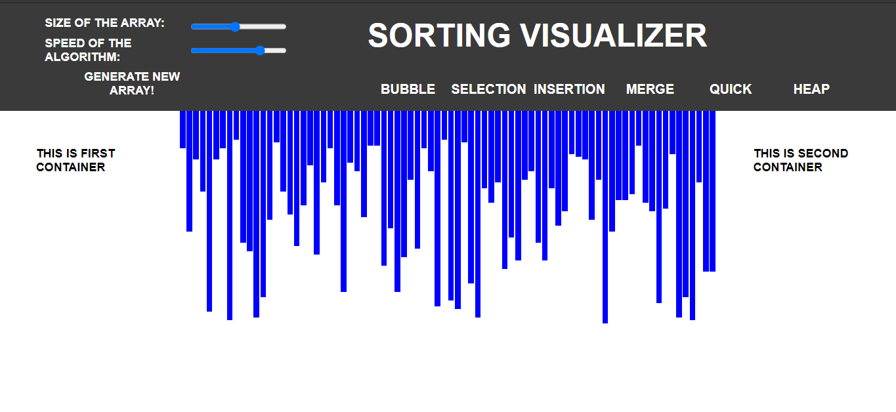

# Sorting_Visualizer

Sorting algorithms are used to sort a data structure according to a specific order relationship, such as numerical order or lexicographical order.

This operation is one of the most important and widespread in computer science. For a long time, new methods have been developed to make this procedure faster and faster.

Implemented algorithms:
1) Bubble sort
2) Selection sort
3) Insertion sort
4) Merge sort
5) Quick sort
6) Heap sort

Features:
1) Colored representation of step being executed.
  1.1) Blue:default
  1.2) Yellow: Being compared
  1.3) Red: Identified as in incorrect position and to be moved
  1.4) Green: In correct position
2) 3 Controls for visualizations
  2.1) Speed of visualization (5 speed levels)
  2.2) Data size ()
  2.3) Generation of new data (Randomly generate new data).
4) Time and Space complexity of algorithm being visualized.

Take a look at live version:

